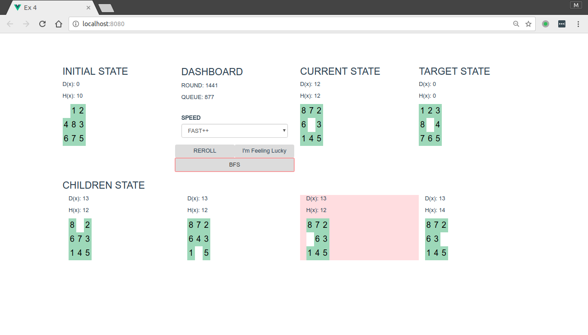

# 用盲目搜索求解八数码问题

## 用法

#### 在线版

直接访问 [kaltzk.github.io/ai-course-exm/4/](https://kaltzk.github.io/ai-course-exm/4/)

### 离线版

在任意浏览器中打开index.html

需要使用Chrome或其他现代浏览器。

具体使用方法见下图

## 运行结果

搜索中

结果

## 算法

在本实验中使用广度了优先搜索搜索八数码问题的解。

* 将初始状态加入OPEN表
* 按照FIFO顺序取出OPEN表中的节点
* 将取出节点中的空位与相邻数字交换，得出子状态
* 将子状态加入OPEN表，将取出状态加入CLOSE表
* 如果遇到存在于CLOSE表的状态，忽略
* 直到找到目标状态或OPEN表为空

为了提高查找效率在实际实现中采用了以下方法:

* 将初始状态加入队列queue(JavaScript的Array)
* 利用Hash函数计算状态的Hash值h
* 将h加入散列表visited(JavaScript的Object)
* 从队列头部取出状态，并算出其子状态
* 检查子状态的Hash值，丢弃所有visited中存在Hash值的子状态
* 将剩余子状态加入队列queue
* 直到找到目标状态或queue为空

(queue, visited)与(OPEN, CLOSE)的对应关系如下

|  /   | 在visited中 | 不在visited中|
| :---------: | :--------: | :---------:|
| 在queue中    |  OPEN     |  N/A       |
| 不在queue中  |  CLOSE      |  未搜到   |

每次拓展子结点时，都会保存其父结点的指针parent，找到目标状态后可通过parent回溯找出完整路径。

## 说明

HTML文件使用的JS脚本位于dist/文件夹下，这些文件由源码编译而来，源码位于src/中，使用语言是CoffeeScript。
