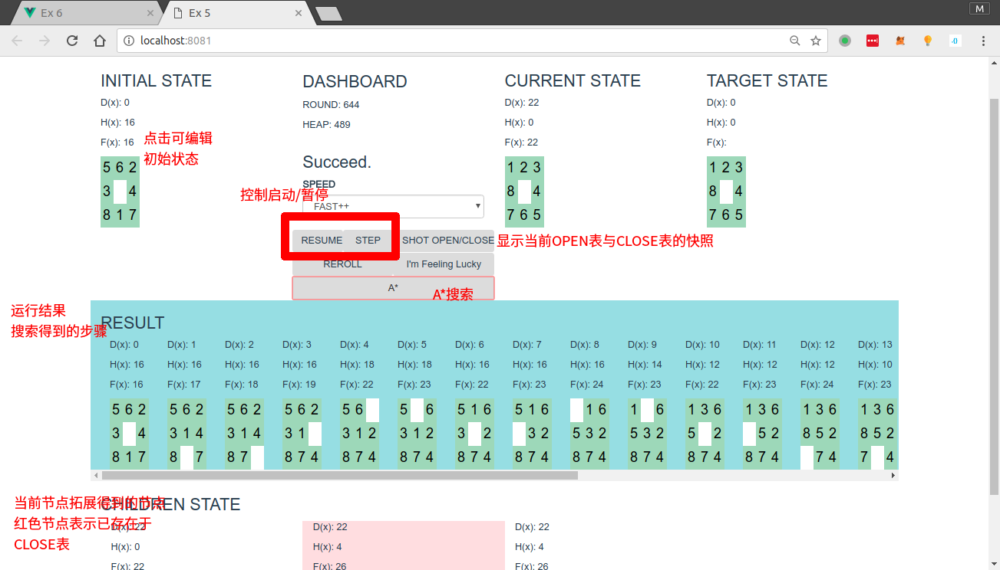

# 用A*搜索求解八数码问题

## 用法

#### 在线版

直接访问 [kaltzk.github.io/ai-course-exm/5/](https://kaltzk.github.io/ai-course-exm/5/)

### 离线版

在任意浏览器中打开index.html

需要使用Chrome或其他现代浏览器。

具体使用方法见下图

(queue, visited)与(OPEN, CLOSE)的对应关系如下

|  /   | 在visited中 | 不在visited中|
| :---------: | :--------: | :---------:|
| 在queue中    |  OPEN     |  N/A       |
| 不在queue中  |  CLOSE      |  未搜到   |

## 说明

HTML文件使用的JS脚本位于dist/文件夹下，这些文件由源码编译而来，源码位于src/中，使用语言是CoffeeScript。
